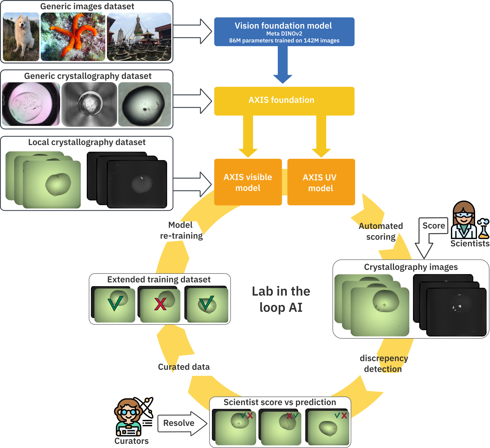

# AXIS
Automated crystal identification system developed at EMBL Grenoble Marquez group by Aurélien Personnaz.

[](https://doi.org/10.1101/2025.11.03.685844)



## Presentation
AXIS proposes a simple procedure to train a crystal identification system on any Crystallography infrastructure images. The system provided will return the presence probability of any crystalline sign (large crystals, needles, micro-crystals, etc.) in an given drop micrograph. It was fully integrated into [EMBL Grenoble Crystallographic Image Management System (CRIMS)](https://www.embl.org/services-facilities/grenoble/high-throughput-crystallisation/), but can be easily replicated in another infrastructure with the following steps:

- An initial labelled dataset must be assembled with local images labelled as *crystal* or *other*. A data extraction from the local LIMS with trustable user scores might be the simplest way. As an example, EMBL grenoble HTX team initial dataset can be downloaded [there](https://doi.org/10.5281/zenodo.17279591). 
- Part of it should be kept as a test set.
- Those initial and test datasets should be used to fine tune the [AXIS foundation](https://huggingface.co/Marquez-Group-EMBL/AXIS-foundation) model using the ``training.py`` script (see below).  
- The model should be integrated in the local LIMS to provide predictions for all new images produced by the infrastructure.
- All images with matching predictions and LIMS user score can be directly used to extend the training dataset. For the contradicting ones, a basic curation system must be used (ideally integrated into the local LIMS) by experts to determine the final label and add them to the new training set.
- The extended training set should be used with the test set to fine tune again the Axis foundation modele.
- The resulting model should be used to replace the previous one in the local LIMS
- Multiple training iterations can be done to improve the system efficiency.

You can find more details and information about the use of UV light images in the  [paper](https://doi.org/10.1101/2025.11.03.685844).


## Installation
Create a python virtual environment and install the dependencies.

```
python -m venv .venv
source .venv/bin/activate
pip install -r requirements.txt
```

The models are pulled and stored in the [HuggingFace repository](https://huggingface.co/)

You will need to sign up and get a write token.

## Training
If you want to log the training in wandb you need to login first:
`wandb login`
The wandb entity and project name can be passed by setting the environment variables WANDB_ENTITY and WANDB_PROJECT
```
export WANDB_ENTITY=*your entity*
export WANDB_PROJECT=*your project*
```

The HuggingFace token must be passed with the environment variable HUGGINGFACE_TOKEN
```
export HUGGINGFACE_TOKEN=*your token*
```

Then run a training with the training.py script.

Example:
`python AXIS_training.py --n_epoch 2 --train_dataset ~/data/CRIMS-v1 --test_dataset ~/data/CRIMS-test`

## Inference
The HuggingFace token must be passed with the environment variable HUGGINGFACE_TOKEN
```
export HUGGINGFACE_TOKEN=*your token*
```

You can run a simple inference by executing

`python AXIS_inference.py --model_checkpoint apersonnaz/AXIS-CRIMS_v3-vis --image_path ~/data/CRIMS-test/vis/other/1000.jpg`
